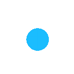
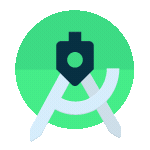

# Hi 👋, I'm EviLuci
<h3 align="left">I am a Linux Enthusiast and Lost Developer. Please help me find my way 🤣</h3>

## 🏆 Github Trophy

  

## 🔗 Connect with me

## 🎧 What I'm Listening To:

## 🛠️ Currently Working On:

- 🔭 I’m currently working on [Ezeekard](https://ezeekard.com/)

- 🌱 I’m currently learning **everything 🤓**

- 👯 I’m looking to collaborate on **open source projects**

- 🤝 Open to contributing to **new and interesting projects**

- 💬 Ask me about **everything but expect nothing 🤣**

<!-- - 📫 How to reach me **sujan.koju111@gmail.com** -->

- ⚡ Fun fact **I was interested in Cybersecurity but ended up joining web development. Tough Life.😄**

---

## 📖 Dev Quote

### 📊 Recent Activity

<!--START_SECTION:activity-->

<!--END_SECTION:activity-->

### 🖥️ OS

| Linux                                                                                                                                        | Arch                                                                                                                                               | Kali                                                                                                                                                                       |
| -------------------------------------------------------------------------------------------------------------------------------------------- | -------------------------------------------------------------------------------------------------------------------------------------------------- | -------------------------------------------------------------------------------------------------------------------------------------------------------------------------- |
|  |  |  |

---

### 🛠️ Languages and Tools

#### 🖥️ Frontend

<table align="left">
  <tr>
    <td align="center" width="96">
      
     Photoshop
    </td>
    <td align="center" width="96">
      
     PremierePro
    </td>
    <td align="center" width="96">
          
       Figma
    </td>
    <td align="center" width="96">
        
       AI
    </td>
    <td align="center" width="96">
          
       Wordpress
    </td>
    <td align="center" width="96">
        
       Woocommerce
    </td>
        <td align="center" width="96">
        
       CSS3
    </td>
    <td align="center" width="96">
        
       HTML5
    </td>
  </tr>
  <tr>
    <td align="center" width="96">
          
       Android
    </td>
    <td align="center" width="96">
          
       Javascript
    </td>
    <td align="center"  width="96">
          
       Flutter
    </td>
        <td align="center" width="96">
          
       ReactNative
    </td>
    <td align="center" width="96">
        
       Tailwind
    </td>
    <td align="center" width="96">
        
       MUI
    </td>
    <td align="center"  width="96">
        
       React
    </td>
    <td align="center" width="96">
        
       Next.js
    </td>
  </tr>
</table>
 

#### 💻 Backend

<table align="left">
  <tr>
    <td align="center" width="96">
        
       MariaDB
    </td>
    <td align="center"  width="96">
        
       MySQL
    </td>
    <td align="center" width="96">
        
       PostgreSQL
    </td>
    <td align="center" width="96">
        
       MongoDB
    </td>
    <td align="center" width="96">
        
       Firebase
    </td>
  </tr>
  <tr>
    <td align="center"  width="96">
        
       Node.js
    </td>
    <td align="center" width="96">
        
       Python
    </td>
    <td align="center" width="96">
         
       Dart
    </td>
    <td align="center" width="96">
        
       Rust
    </td>
  </tr>
</table>
 

#### 🔧 DevOps

<table align="left">
  <tr>
    <td align="center" width="96">
        
       Git
    </td>
    <td align="center" width="96">
        
       GitHub
    </td>
    <td align="center" width="96">
        
       GitLab
    </td>
  </tr>
  <tr>
    <td align="center"  width="96">
          
       AWS
    </td>
    <td align="center" width="96">
        
       GCP
    </td>
    <td align="center" width="96">
        
       Azure
    </td>
    <td align="center" width="96">
          
       Docker
    </td>
  </tr>
  <tr>
    <td align="center" width="96">
        
       Nginx
    </td>
    <td align="center" width="96">
        
       Vercel
    </td>
    <td align="center" width="96">
        
       Bash
    </td>
    <td align="center" width="96">
        
       Linux
    </td>
  </tr>
</table>
 

### 📊 My GitHub Stats 🔥

 

## 
  
 
   

### 🐍 GitHub Contribution Snake:

 

<!--
**EviLuci/EviLuci** is a ✨ _special_ ✨ repository because its `README.md` (this file) appears on your GitHub profile.

Here are some ideas to get you started:

- 🔭 I’m currently working on ...
- 🌱 I’m currently learning ...
- 👯 I’m looking to collaborate on ...
- 🤔 I’m looking for help with ...
- 💬 Ask me about ...
- 📫 How to reach me: ...
- 😄 Pronouns: ...
- ⚡ Fun fact: ...
-->
